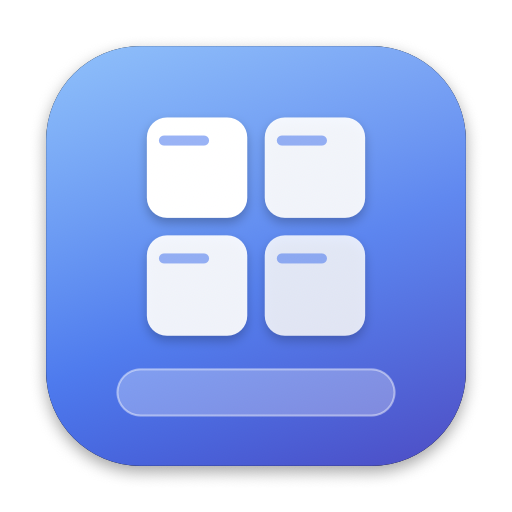

<p align="center">
  
</p>

<h1 align="center">Macindows</h1>

<p align="center">
  <b>The Windows habits you can't shake, working on your Mac.</b><br>
  A small menu bar app that adds the Windows desktop behaviors macOS left out.
</p>

<p align="center">
  
  
  
</p>

---

## Why Macindows?

You moved to a Mac, or you switch between a Mac and a Windows PC every day. Your hands still reach for the taskbar, Enter to open a file, Backspace to go back, and Alt + Shift to change language. On macOS, those habits do nothing.

Macindows gives them back. Clicking a Dock icon minimizes the app. Hovering it shows live window previews. Finder responds to the keys you expect. Your mouse wheel scrolls one line per notch, with no acceleration. You can also lock private apps behind Touch ID.

Every feature is a switch in Settings. Turn on what you need and leave the rest off. Macindows has no account, no telemetry and no network calls. It runs in your menu bar.

## Features

### Taskbar-style Dock

| Feature | What it does |
|---|---|
| **Click to minimize** | Click the Dock icon of the app in front to minimize all its windows, like the Windows taskbar. Click again to restore them. |
| **Live window thumbnails** | Hover a Dock icon to see a live preview of each window. Click a thumbnail to restore or minimize that window, **×** to close it, or right-click / **⋯** for *Minimize All* and *Quit*. You can set the show and hide delays. |
| **Restore on ⌘ Tab** | If you ⌘ Tab to an app whose windows are all minimized, one window comes back. On stock macOS, nothing happens. |
| **Double-click title bar to fill** | Double-click any title bar to fill the screen, and double-click again to return to the previous size. Works like *Maximize* on Windows, without going full screen. |
| **Show desktop** | Click the Macindows menu bar icon to hide every app and show the desktop. Click again to bring everything back, like *Win + D*. |

### Finder like Explorer

| Feature | What it does |
|---|---|
| **Control + scroll to zoom icons** | In icon view, hold **⌃ Control** and scroll to make icons bigger or smaller. For smooth live resizing, turn on *View › Show Status Bar* (⌘ /) in Finder. |
| **Enter opens** | Press **Enter** to open the selected file or folder. While you rename an item, Enter still confirms the name. |
| **F2 renames** | Press **F2** to rename. On Mac keyboards, press **fn + F2**, or set the F-keys as standard function keys in System Settings › Keyboard. |
| **Backspace goes back** | Press **Backspace** to go to the previous folder. In text fields, Backspace still deletes. |

### Mouse that behaves

| Feature | What it does |
|---|---|
| **Raw 1:1 scrolling** | Each mouse wheel notch scrolls a fixed number of lines (1–20). There is no acceleration and no smoothing. Your trackpad is not changed. |
| **Faster pointer** | A speed multiplier of up to 2× above the macOS maximum. Useful on large or high-resolution displays. At 1.0×, your system setting stays as it is. |

### Keyboard

| Feature | What it does |
|---|---|
| **⌘ + ⇧ switches language** | Press and release Command + Shift together to go to the next input source, like Alt + Shift on Windows. Shortcuts such as ⌘⇧S keep working. |

### App Lock

Keep private apps such as Messages, Photos or your password manager hidden from anyone who uses your Mac.

- Add apps in **Settings › App Lock**.
- A locked app stays hidden until you pass **Touch ID** or enter your login password. While the prompt is open, a full-screen cover hides the app's windows.
- A locked app stays out of Dock thumbnails, *Show All* and desktop restore.
- An app locks again when it quits, closes its last window, the screen locks or the Mac sleeps.
- Press **⌃ ⌘ L** to lock all locked apps at once.

### General

- **Start at login** with one switch.
- **Permissions guide** on first launch, which shows what is granted and what still needs your approval.

## Install

1. Download **Macindows-1.0.dmg** from the [latest release](https://github.com/ahm3drgb/Macindows/releases/latest).
2. Open the DMG and drag **Macindows** to **Applications**.
3. Open Macindows. The first time, right-click the app and choose **Open**. (Version 1.0 is not notarized yet.)
4. Follow the permissions guide, then relaunch Macindows.

**Requirements:** macOS 14 Sonoma or later. Touch ID is optional; App Lock falls back to your login password.

### Permissions

Macindows asks only for the permissions its features need. Everything stays on your Mac.

| Permission | Used for |
|---|---|
| **Accessibility** | Dock clicks, minimize and restore, title bar double-click, window thumbnails |
| **Input Monitoring** | Raw scroll, pointer speed, Finder keys, ⌘ ⇧ language switch |
| **Screen Recording** | Live window thumbnails in the Dock preview only. Nothing is recorded or saved. |
| **Automation (Finder)** | Control + scroll icon resizing. macOS asks the first time you use it. |

Relaunch Macindows after you grant Screen Recording.

## Usage

- **Left-click** the menu bar icon: show desktop (if turned on).
- **Right-click** the menu bar icon: open the menu, including **Settings**.
- In **Settings**, each pane (Dock, Finder, Mouse, Keyboard, App Lock, General) has a switch for each feature.

## Build from source

You need Xcode Command Line Tools (`xcode-select --install`) and a code signing identity.

```sh
git clone https://github.com/ahm3drgb/Macindows.git
cd Macindows
./build.sh          # builds Macindows.app, signed with "Apple Development"
open Macindows.app
```

`build.sh` signs with a stable identity, so macOS keeps your Accessibility and Input Monitoring grants between rebuilds. Ad-hoc signing changes the app identity on each build, and macOS then drops the grants. To use a different identity, set `SIGN_ID`.

To package a DMG:

```sh
./make_dmg.sh       # builds the app and creates Macindows-<version>.dmg
```

To make a release build for other Macs, you need a Developer ID certificate and notarization:

```sh
SIGN_ID="Developer ID Application: Name (TEAMID)" NOTARY_PROFILE=macindows ./make_dmg.sh
```

### Project layout

| File | Purpose |
|---|---|
| `AppDelegate.swift` | Menu bar item, event taps, Dock, Finder, mouse and keyboard features, window thumbnails |
| `AppLock.swift` | Touch ID app lock |
| `SettingsView.swift` | Settings window, preferences and permissions guide |
| `main.swift` | App entry point |
| `make_icon.swift` | Generates the app icon |
| `build.sh` / `make_dmg.sh` | Build, sign, package and notarize |

## Troubleshooting

- **A feature does nothing.** Open **Settings › General › Permissions** and check that every permission is granted. Then relaunch Macindows.
- **Thumbnails are blank.** Grant Screen Recording, then relaunch Macindows.
- **Finder zoom flickers.** In Finder, turn on *View › Show Status Bar*.
- **Permissions reset after a rebuild.** Sign with a stable identity, not ad-hoc (`-`).
- **Logs:** `~/Library/Logs/Macindows.log` (contains event tap failures only).

## Feedback

Bug reports and feature requests are welcome. Open an issue on [GitHub](https://github.com/ahm3drgb/Macindows/issues).

## License

Copyright © 2026 Ahmed Abokhalil. All rights reserved.

The source code is published for viewing and reference only. You may not copy, modify or redistribute it without written permission. You may use the official releases for personal use. See [LICENSE](LICENSE) for the full terms.

---

<p align="center">Made with ❤️ by <b>Ahmed Abokhalil</b><br><sub>© 2026 Ahmed Abokhalil. All rights reserved.</sub></p>
